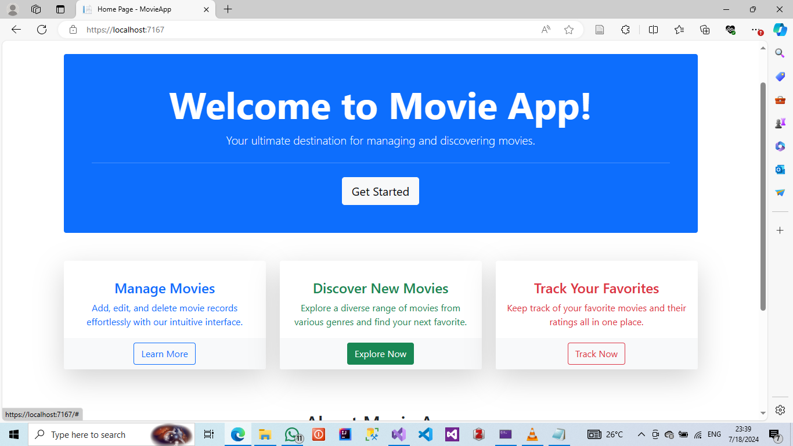
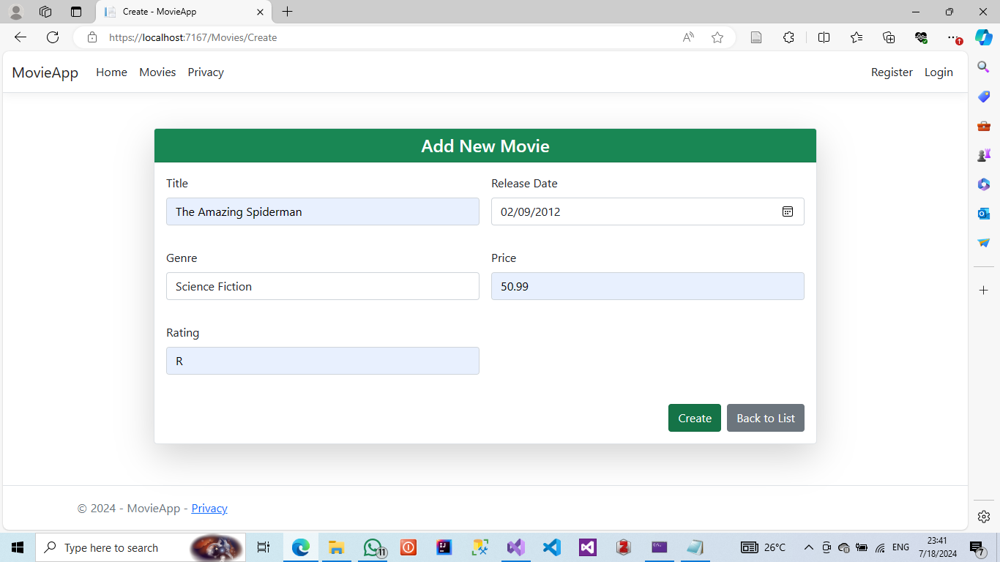
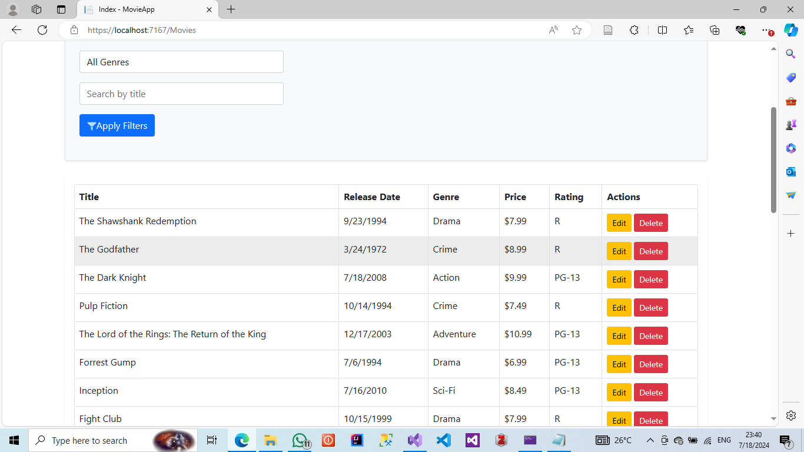
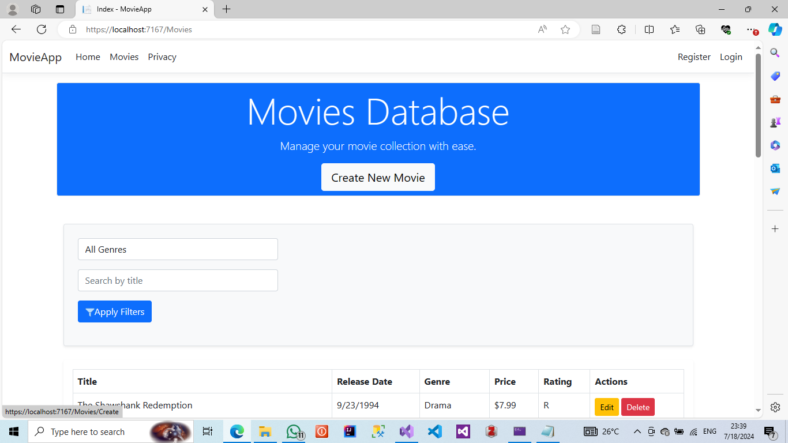
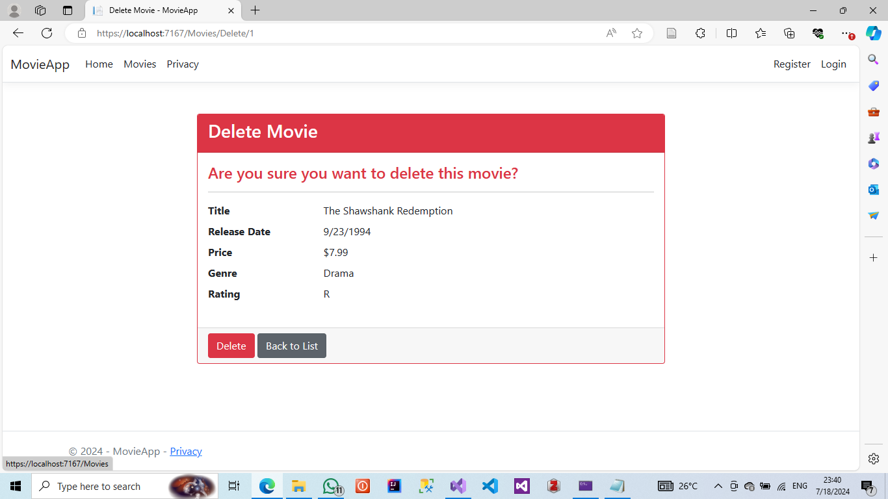

# 🎬 MovieApp

Welcome to MovieApp, a comprehensive solution for managing and discovering movies. This app allows you to manage your movie collection, explore new movies, and track your favorites with ease.

## 🚀 Getting Started

### Prerequisites

Make sure you have the following installed:
- [.NET Core SDK](https://dotnet.microsoft.com/download) (version 5.0 or later)
- [Git](https://git-scm.com/)

### Installation

1. **Clone the repository:**

   ```bash
   git clone https://github.com/MasterWithAhmad/MovieApp.git
  ## 1. Navigate into the project directory:
  
  ```bash
cd MovieApp
```
  ## 2. Restore the project dependencies:
```
  dotnet restore
```

  ## 3. Run the application:
```
  dotnet run
  ```
  ## 4. The application will start and be accessible at
  
  http://localhost:5000.

  ## 📸 Screenshots
  Here are some screenshots of the application:
  
  
 

 
 ## 🛠️ FeaturesManage Movies: 
1. Easily add, edit, and delete movie records.
2. Discover New Movies: Search and explore a wide range of movies.
3. Track Your Favorites: Keep track of your favorite movies and ratings.
4. ## 🤝 Contributing
   We welcome contributions to enhance MovieApp.
   Please follow these steps:
   ## Fork the repository.
   Create a feature branch
   ```
   git checkout -b feature-branch.
   ```
   Commit your changes
   ```
   git commit -am 'Add new feature'.
   ```
   Push to the branch
   ```
   git push origin feature-branch.
   ```
   Create a new Pull Request.
   ## 📜 License:
   This project is licensed under the MIT License.
   ## 📞 Contact
   For any questions or feedback, please reach out to ahmad.eyhash@gmail.com
   Thank you for checking out MovieApp! 🎥✨
